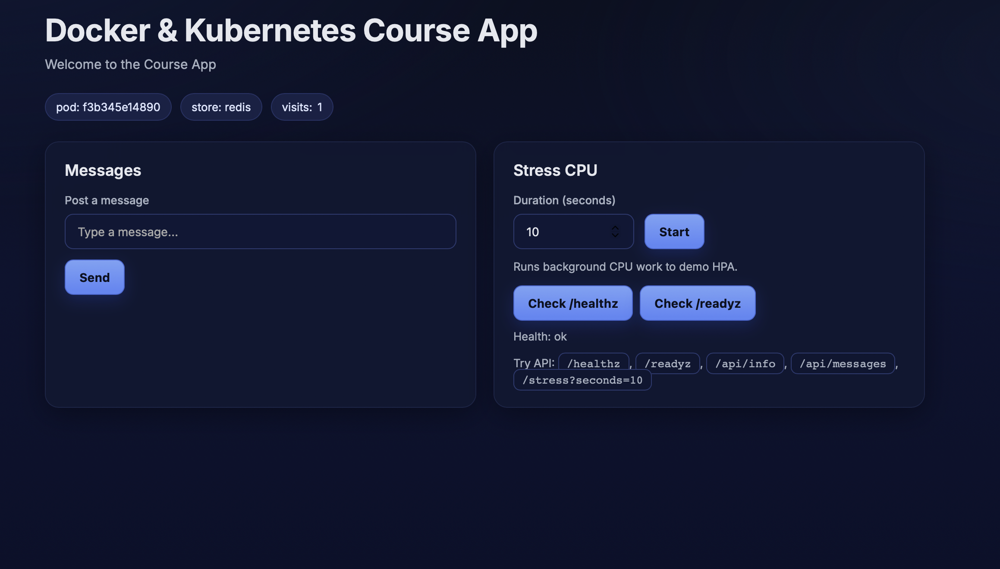

# homework-lesson-04-Yevhen-Marholin

## Docker Compose для course-app

Було створено `docker-compose.yml` для застосунку `apps/course-app`.

## Dockerfile

Було створено файл `Dockerfile` для застосунку `apps/course-app`, який використовується для збірки образу та запуску контейнера.

```dockerfile
FROM python:3.12-alpine

WORKDIR /src

COPY requirements.txt .
RUN pip install --no-cache-dir -r requirements.txt

COPY . .

EXPOSE 8080

CMD ["uvicorn", "src.main:app", "--host", "0.0.0.0", "--port", "8080"]
```

## Compose файл

```yaml
services:
  app:
    build: .
    container_name: course-app
    ports:
      - "8080:8080"
    environment:
      APP_STORE: redis
      APP_REDIS_URL: redis://redis:6379/0
    depends_on:
      - redis

  redis:
    image: redis:7-alpine
    container_name: course-app-redis
```

## Запуск

```bash
docker compose up --build
```

або

```bash
docker compose up -d --build
```

## Перевірка

Відкрити в браузері:

- http://localhost:8080
- http://localhost:8080/healthz

curl http://localhost:8080
curl http://localhost:8080/healthz

        <html>
            <head>
                <title>Course App</title>
                <meta name=viewport content="width=device-width, initial-scale=1" />
                <link rel="preconnect" href="https://fonts.googleapis.com" />
                <link rel="preconnect" href="https://fonts.gstatic.com" crossorigin />
                <link href="https://fonts.googleapis.com/css2?family=Inter:wght@400;500;600;700&display=swap" rel="stylesheet" />
                <style>
                    :root {
                        --bg:#0b1020;
                        --bg-grad1:#0b1020; /* start */
                        --bg-grad2:#0d1330; /* mid */
                        --bg-grad3:#0a0f28; /* end */
                        --card:#101833cc; /* translucent */
                        --card-border:#28345f80;
                        --text:#e6e8ef;
                        --muted:#a7b0c0;
                        --accent:#7aa2f7;
                        --accent-600:#5d87f6;
                        --accent-700:#4b75ea;
                        --ok:#98c379; --warn:#e5c07b; --err:#e06c75;
                        --ring:#9ab6ff;
                    }

                    * { box-sizing: border-box; }
                    html, body { height: 100%; }
                    body {
                        font-family: "Inter", system-ui, -apple-system, Segoe UI, Roboto, sans-serif;
                        margin:0;
                        color:var(--text);
                        background:
                            radial-gradient(1200px 600px at 10% -10%, #20327544, transparent 60%),
                            radial-gradient(1000px 500px at 95% 10%, #1b254d55, transparent 60%),
                            linear-gradient(180deg, var(--bg-grad1) 0%, var(--bg-grad2) 40%, var(--bg-grad3) 100%);
                    }

                    .wrap {
                        max-width: 1100px;
                        margin: 0 auto;
                        padding: 32px clamp(20px, 4vw, 40px) 48px;
                    }

                    header.app {
                        display:flex; align-items:flex-start; justify-content:space-between; gap:16px;
                        margin-bottom: 24px;
                    }
                    h1 { margin: 0; font-size: clamp(28px, 2.4vw, 36px); letter-spacing: -0.015em; }
                    p.lead { margin: 8px 0 0 0; color: var(--muted); font-size: 15px; }

                    .pillbar { margin:12px 0 24px 0; display:flex; flex-wrap:wrap; gap:10px; }
                    .badge {
                        display:inline-flex; align-items:center; gap:6px;
                        background: #1b254dcc; color:#dde6ff; padding:7px 12px;
                        border:1px solid #2a376ecc; border-radius:999px; font-size:13px;
                        backdrop-filter: blur(6px);
                    }

                    .grid { display: grid; grid-template-columns: repeat(auto-fit, minmax(300px, 1fr)); gap: 20px; }
                    .card {
                        background: var(--card);
                        border:1px solid var(--card-border);
                        border-radius: 16px;
                        padding: 22px;
                        box-shadow: 0 8px 32px rgba(0,0,0,0.35);
                        backdrop-filter: blur(10px);
                    }
                    .card h3 { margin: 0 0 16px 0; font-size: 18px; font-weight: 600; }

                    label { display:block; font-size: 13px; font-weight: 500; color: var(--muted); margin-bottom: 8px; }
                    input[type=text], input[type=number] {
                        width:100%; background:#0f1736; color:var(--text); font-size: 14px;
                        border:1px solid #2b3970; padding:11px 14px; border-radius:10px;
                        outline: none; transition: box-shadow .15s ease, border-color .15s ease;
                    }
                    input[type=text]:focus, input[type=number]:focus {
                        border-color: var(--ring);
                        box-shadow: 0 0 0 3px #9ab6ff33;
                    }

                    button {
                        background: linear-gradient(180deg, var(--accent) 0%, var(--accent-600) 90%);
                        border: 1px solid #4569d6;
                        color: #0b1020; font-weight: 700; font-size: 14px; letter-spacing: .01em;
                        padding: 11px 16px; border-radius: 10px; cursor: pointer;
                        transition: transform .06s ease, filter .2s ease, box-shadow .2s ease;
                        box-shadow: 0 6px 18px #2540a855;
                    }
                    button:hover { filter: brightness(1.02); box-shadow: 0 8px 22px #2540a866; }
                    button:active { transform: translateY(1px); }
                    button:disabled { opacity: .6; cursor: default; box-shadow:none; }

                    ul.msgs {
                        list-style:none; padding:0; margin:0;
                        display:flex; flex-direction:column; gap:12px;
                        max-height:300px; overflow-y:auto;
                        scrollbar-width: thin;
                        scrollbar-color: #2b3970 transparent;
                    }
                    ul.msgs::-webkit-scrollbar { width: 8px; }
                    ul.msgs::-webkit-scrollbar-track { background: transparent; }
                    ul.msgs::-webkit-scrollbar-thumb { background: #2b3970; border-radius: 4px; }
                    ul.msgs::-webkit-scrollbar-thumb:hover { background: #3a4a8a; }
                    ul.msgs li { background:#0f1632; border:1px solid #2b3970; padding:14px; border-radius:10px; }

                    .row { display:flex; gap:12px; align-items:center; flex-wrap:wrap; }
                    code { background:#0f1632; border:1px solid #2b3970; padding:4px 9px; border-radius:8px; font-size: 13px; }
                    a { color:#9ab6ff; text-decoration: none; }
                    a:hover { text-decoration: underline; }
                </style>
            </head>
      <body>
                <div class="wrap">
                    <header class="app">
                        <div>
                            <h1>Docker & Kubernetes Course App</h1>
                            <p class="lead">Welcome to the Course App</p>
                        </div>
                    </header>
                    <div class="pillbar">
                        <span class="badge">pod: f3b345e14890</span>
                        <span class="badge">store: redis</span>
                        <span class="badge">visits: <span id="visits">2</span></span>
                    </div>

          <div class="grid">
            <section class="card">
              <h3>Messages</h3>
              <form id="msgForm" onsubmit="return false;" style="margin-bottom:14px">
                <label for="msgInput">Post a message</label>
                <div class="row">
                  <input id="msgInput" type="text" placeholder="Type a message..." />
                  <button id="btnPost">Send</button>
                </div>
                <div id="msgStatus" style="font-size:13px;color:var(--muted);margin-top:6px;"></div>
              </form>
              <ul id="msgList" class="msgs"></ul>
            </section>

            <section class="card">
              <h3>Stress CPU</h3>
              <label for="secInput">Duration (seconds)</label>
              <div class="row" style="margin-bottom:12px">
                <input id="secInput" type="number" min="1" max="120" value="10" style="max-width:140px" />
                <button id="btnStress">Start</button>
              </div>
              <div id="stressStatus" style="font-size:13px;color:var(--muted);margin-bottom:14px;">Runs background CPU work to demo HPA.</div>
              <div style="margin-bottom:14px">
                <div class="row" style="gap:8px">
                  <button id="btnHealth">Check /healthz</button>
                  <button id="btnReady">Check /readyz</button>
                </div>
                <div id="hzStatus" style="font-size:13px;margin-top:10px;color:var(--muted);"></div>
              </div>
              <div style="font-size:13px;color:var(--muted);line-height:1.5;">
                Try API: <code>/healthz</code>, <code>/readyz</code>, <code>/api/info</code>, <code>/api/messages</code>, <code>/stress?seconds=10</code>
              </div>
            </section>
          </div>
        </div>

        <script>
          async function fetchJSON(url, opts={}) {
            const r = await fetch(url, opts);
            if (!r.ok) throw new Error(await r.text());
            return r.json();
          }

          async function loadMessages() {
            try {
              const data = await fetchJSON('/api/messages?limit=50');
              const list = document.getElementById('msgList');
              list.innerHTML = '';
              for (const it of (data.items || [])) {
                const li = document.createElement('li');
                const dt = new Date(it.created_at || '').toLocaleString();
                li.innerHTML = `<div style="font-size:12px;color:var(--muted)">#${it.id} • ${dt}</div><div>${(it.text||'')}</div>`;
                list.appendChild(li);
              }
            } catch(e) {
              console.warn('loadMessages failed', e);
            }
          }

          async function refreshVisits() {
            try {
              const data = await fetchJSON('/api/counter/visits');
              document.getElementById('visits').textContent = data.value;
            } catch { /* ignore */ }
          }

          document.getElementById('btnPost').addEventListener('click', async () => {
            const input = document.getElementById('msgInput');
            const btn = document.getElementById('btnPost');
            const st = document.getElementById('msgStatus');
            const text = (input.value || '').trim();
            if (!text) return;
            btn.disabled = true; st.textContent = 'Posting...';
            try {
              const body = new URLSearchParams(); body.set('text', text);
              await fetchJSON('/api/messages', { method:'POST', headers:{'Content-Type':'application/x-www-form-urlencoded'}, body });
              input.value=''; st.textContent = 'Posted!';
              await loadMessages(); await refreshVisits();
            } catch(e) {
              st.textContent = 'Error: ' + (e.message || 'failed');
            } finally { btn.disabled = false; }
          });

          document.getElementById('btnStress').addEventListener('click', async () => {
            const sec = Math.max(1, Math.min(120, parseInt(document.getElementById('secInput').value || '10')));
            const st = document.getElementById('stressStatus');
            st.textContent = 'Starting stress for ' + sec + 's...';
            try {
              await fetchJSON(`/stress?seconds=${sec}&background=true`);
              st.textContent = 'Stress started. Generate load in parallel to see HPA.';
            } catch(e) { st.textContent = 'Error: ' + (e.message || 'failed'); }
          });

          document.getElementById('btnHealth').addEventListener('click', async () => {
            const st = document.getElementById('hzStatus');
            try { const x = await fetchJSON('/healthz'); st.textContent = 'Health: ' + x.status; }
            catch(e) { st.textContent = 'Health error'; }
          });
          document.getElementById('btnReady').addEventListener('click', async () => {
            const st = document.getElementById('hzStatus');
            try { const x = await fetchJSON('/readyz'); st.textContent = 'Ready: ' + x.status; }
            catch(e) { st.textContent = 'Ready error'; }
          });

          loadMessages();
        </script>
      </body>
    </html>
    {"status":"ok"}@YevhenMarholin ➜ /workspaces/homework-lesson-04-Yevhen-Marholin (main) $ 

```bash
curl http://localhost:8080
curl http://localhost:8080/healthz
```

## Змінні середовища

```env
APP_STORE=redis
APP_REDIS_URL=redis://redis:6379/0
```

## Додатковий сервіс

У Compose файл додано другий сервіс `redis` як зовнішнє сховище для застосунку.

## Перевірка роботи

```bash
docker compose ps
docker compose logs
```
```
 /workspaces/homework-lesson-04-Yevhen-Marholin/course-app (main) $ docker compose up --build
[+] Building 0.9s (13/13) FINISHED                                                                                    
 => [internal] load local bake definitions                                                                       0.0s
 => => reading from stdin 561B                                                                                   0.0s
 => [internal] load build definition from Dockerfile                                                             0.0s
 => => transferring dockerfile: 247B                                                                             0.0s
 => [internal] load metadata for docker.io/library/python:3.12-alpine                                            0.5s
 => [auth] library/python:pull token for registry-1.docker.io                                                    0.0s
 => [internal] load .dockerignore                                                                                0.0s
 => => transferring context: 2B                                                                                  0.0s
 => [1/5] FROM docker.io/library/python:3.12-alpine@sha256:54a808cea192d0875e5a384b1ad57316bbd0b410a4d95ef1f040  0.0s
 => => resolve docker.io/library/python:3.12-alpine@sha256:54a808cea192d0875e5a384b1ad57316bbd0b410a4d95ef1f040  0.0s
 => [internal] load build context                                                                                0.0s
 => => transferring context: 462B                                                                                0.0s
 => CACHED [2/5] WORKDIR /src                                                                                    0.0s
 => CACHED [3/5] COPY requirements.txt .                                                                         0.0s
 => CACHED [4/5] RUN pip install --no-cache-dir -r requirements.txt                                              0.0s
 => [5/5] COPY . .                                                                                               0.0s
 => exporting to image                                                                                           0.1s
 => => exporting layers                                                                                          0.0s
 => => exporting manifest sha256:51021f9db53cd55803db65a669786bde3a1391b2288543613cc22e51934b73fb                0.0s
 => => exporting config sha256:439429709b090fe326529425aa91828c730dc57b4ae80729fdaf04e3bcbb45a0                  0.0s
 => => exporting attestation manifest sha256:61732fb77df71e149290ad8f7de80b70746e71750bcd7e34f999f2ab7dbaf429    0.0s
 => => exporting manifest list sha256:919bbb56a0447df8bebc80b579c0e3fd670f35bead0f736bcc6c2ba6ffc7a9e8           0.0s
 => => naming to docker.io/library/course-app-app:latest                                                         0.0s
 => => unpacking to docker.io/library/course-app-app:latest                                                      0.0s
 => resolving provenance for metadata file                                                                       0.0s
[+] Running 2/2
 ✔ course-app-app        Built                                                                                   0.0s 
 ✔ Container course-app  Recreated                                                                               0.1s 
Attaching to course-app, course-app-redis
course-app-redis  | 1:C 16 Apr 2026 15:47:06.661 # WARNING Memory overcommit must be enabled! Without it, a background save or replication may fail under low memory condition. Being disabled, it can also cause failures without low memory condition, see https://github.com/jemalloc/jemalloc/issues/1328. To fix this issue add 'vm.overcommit_memory = 1' to /etc/sysctl.conf and then reboot or run the command 'sysctl vm.overcommit_memory=1' for this to take effect.
course-app-redis  | 1:C 16 Apr 2026 15:47:06.661 * oO0OoO0OoO0Oo Redis is starting oO0OoO0OoO0Oo
course-app-redis  | 1:C 16 Apr 2026 15:47:06.661 * Redis version=7.4.8, bits=64, commit=00000000, modified=0, pid=1, just started
course-app-redis  | 1:C 16 Apr 2026 15:47:06.661 # Warning: no config file specified, using the default config. In order to specify a config file use redis-server /path/to/redis.conf
course-app-redis  | 1:M 16 Apr 2026 15:47:06.661 * Increased maximum number of open files to 10032 (it was originally set to 1024).
course-app-redis  | 1:M 16 Apr 2026 15:47:06.661 * monotonic clock: POSIX clock_gettime
course-app-redis  | 1:M 16 Apr 2026 15:47:06.662 * Running mode=standalone, port=6379.
course-app-redis  | 1:M 16 Apr 2026 15:47:06.663 * Server initialized
course-app-redis  | 1:M 16 Apr 2026 15:47:06.663 * Loading RDB produced by version 7.4.8
course-app-redis  | 1:M 16 Apr 2026 15:47:06.663 * RDB age 8 seconds
course-app-redis  | 1:M 16 Apr 2026 15:47:06.663 * RDB memory usage when created 0.90 Mb
course-app-redis  | 1:M 16 Apr 2026 15:47:06.663 * Done loading RDB, keys loaded: 0, keys expired: 0.
course-app-redis  | 1:M 16 Apr 2026 15:47:06.664 * DB loaded from disk: 0.000 seconds
course-app-redis  | 1:M 16 Apr 2026 15:47:06.664 * Ready to accept connections tcp
course-app        | INFO:     Started server process [1]
course-app        | INFO:     Waiting for application startup.
course-app        | INFO:     Application startup complete.
course-app        | INFO:     Uvicorn running on http://0.0.0.0:8080 (Press CTRL+C to quit)
course-app        | INFO:     172.18.0.1:56198 - "GET / HTTP/1.1" 200 OK
course-app        | INFO:     172.18.0.1:56210 - "GET /api/messages?limit=50 HTTP/1.1" 200 OK
course-app        | INFO:     172.18.0.1:56214 - "GET /favicon.ico HTTP/1.1" 404 Not Found
course-app        | INFO:     172.18.0.1:41724 - "GET /healthz HTTP/1.1" 200 OK
course-app        | INFO:     172.18.0.1:41726 - "GET /readyz HTTP/1.1" 200 OK
course-app        | INFO:     172.18.0.1:41740 - "GET /healthz HTTP/1.1" 200 OK
course-app        | INFO:     172.18.0.1:54218 - "GET /stress?seconds=10&background=true HTTP/1.1" 200 OK


w Enable Watch
```
## Висновок

- описано Compose файл для `apps/course-app`
- перевірено доступність застосунку
- перевірено `/healthz`
- додано сервіс `redis`
- додано змінні середовища
- Compose працює без помилок
